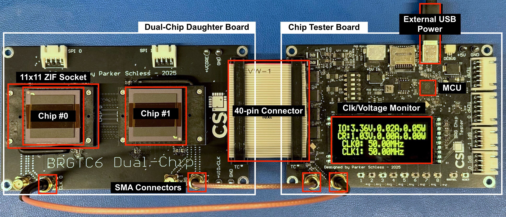

# brg-chip-tester
BRG Chip Tester Firmware

# Dependencies
- Pi Pico VSCode extension must be installed
- To set up for your local build environment:
  + Go to the Pi Pico extension tab
  + Select "Import Project"
  + Change the path to match this cloned directory
  + Select SDK version as "v2.1.0"
  + Select the green "Import" button in the bottom right
  + Compiling and running the project is done using the
    corresponding buttons in the bottom right of VSCode

# Running Independent Demo Programs
- Setup: use this image as reference:
  + Ensure the two clock SMA cables are connected from the Tester Board to
    the daughter board
  + Ensure the 40-pin bridge is connecting both boards together
  + Ensure the chips are plugged into the daughter board in the correct
    orientation as seen here (notice the location of the gold
    indicator on the chips in the image above)
  + Source 5V to the Tester Board using one of the following options
    - Connect a 5V wall-adapter with an appropriately-sized barrel connector
      to the barrel jack on the Tester Board
    - Connect a 5V benchtop power supply directly to the 5V and GND testpoints
      on the Tester Board
    - Connect a USB-C to USB-A cable to the USB-C port on the Tester Board
      and to a laptop or a USB wall-adapter
    - NOTE: DO NOT USE MORE THAN ONE 5V POWER SOURCE AT A TIME
- Startup
  + Version 1.0 of the Tester Board can be a bit finnicky with startup,
    particularly with the screen. If the screen does not turn on when plugging
    in the board, unplug the power and plug it back in until the screen turns
    on. It may take a couple of tries, but be patient. Additionally, if the
    screen turns on but it does not show any current being drawn on the IO
    channel, that means the clock generator did not properly come out of reset -
    unplug the board and plug it back in until you see current being sourced
    on the IO channel. Both of these issues will be fixed in the next version
    of the Tester Board.
  + Upon a successful startup, you should see the status screen showing the
    voltage, current, and power draw on both the IO and core (CR) channels, as
    well as the clock frequencies for both generated clocks. Current should be
    drawn on the IO channel as the clocks are toggling the clock IO pins on the
    chips.
- Detailed SPI Message Prinouts
  + Connect the board to a lapto via a USB-C to USB-A adapter (make sure other
    5V power sources are disconnected) and start the Python interface program
    as defined in the section below to see a detailed list of SPI messages
    sent for each demo program when run.
- Demo Programs
  + Pressing the "1" button will return to the status screen seen on startup
  + Pressing the "2" button will start a loopback configuration test where
    each chip is configured with the specified settings as seen in the test
    vector `brgtc6_single_config_loopback_test_0/1` in `brgtc6_test.c` to
    verify both chips are responding correctly to configuration commands. A
    `TEST PASS` message should be printed upon successful test completion.
  + Pressing the "3" button will start a fixed pattern test where both links
    will be configured to send specific alternating fixed patterns to each other
    for 10 seconds, and then confirming that the observed patterns on both chips
    are correct. The specific SPI commands sent are seen in the test vector
    `brgtc6_dual_pattern_fixed_test` on in `brgtc6_test.c`. This test is run
    for the following clock frequency combinations: chip 0 and chip 1 both 200
    MHz, chip 0 200 MHz and chip 1 10 MHz, chip 0 10 MHz and chip 1 200 MHz.
    Upon successful completion of all three tests, a `TEST PASS` message should
    be printed.
  + Pressing the "4" button will start an identical test to that when pressing
    "3", except this time using the PRBS to send pseudo-random messages. The
    test vector for this demo is `brgtc6_dual_pattern_lfsr_test` in
    `brgtc6_test.c`.

# Interfacing with the Board over USB
- Plug in the board via the USB-C connector
- Run the `Chip_Tester.py` program, ensure the COM port is set correctly
  for the given board.
- Receving messages
  + Messages received from the board will be immediately printed to the
    console output.
- Sending messages
  - `t<1, 2, 3>` - this command will run the same demos outlined in the above
    Demo Programs section in the same order they have been listed.
      + Example: `t2` - runs the fixed pattern demo described above.
  - `b<chip (0 or 1)><5-digit number>` - this command will do a write of the 5-digit
    hexadecimal number provided to the specified chip (0 or 1) over SPI, as well
    as performs a subsequent read from that chip. Note that the width of this
    hex number is dependent on the number of SPI bits that are used, which is
    set as 20 for BRGTC6.
      + Example: `b012345` - writes 0x12345 to chip 0 and performs a read,
        printing the read value to the console.
  - `r<chip (0 or 1)` - this command does a read from the specified chip (0 or 1)
    over SPI.
      + Example: `r1` - reads an SPI value from chip 1, fails if a value is
        not available after a timeout period set in software.
  - `w<chip (0 or 1)><5-digit number>` - this command will do a write of the 5-digit
    hexadecimal number provided to the specified chip (0 or 1) over SPI. Note that 
    the width of this hex number is dependent on the number of SPI bits that are 
    used, which is set as 20 for BRGTC6.
      + Example: `w13BCDE` - writes 0x3BCDE to chip 1 over SPI.
  - `ss<num>` - this command will set the SPI speed in bits per second to
    the given number. This is 1000 by default.
      - Example: `ss10000` - sets the SPI speed to 10000 bps.
  - `sb<num>` - this command will set the SPI bitwidth to the given number. 
    This is 20 by default.
      - Example: `sb30` - sets the SPI bitwidth to 30 bits.
  - `vc
<float num>` - this command sets the core voltage to the float number
    provided to it, with the maximum value being 3.4V. If the p-flag is added,
    the provided voltage will be set in nonvolatile memory so that it is used
    on startup of the board, this value is 1.0V by default.
      - Example: `vcp1.1` - sets the core voltage on startup to be 1.1V.
      - Example: `vc1.1` - immediately sets the core voltage to be 1.1V, but
        the voltage on startup will be the value stored in NVM before.
  - `vi
<float num>` - this command sets the IO voltage to the float number
    provided to it, with the maximum value being 3.4V. If the p-flag is added,
    the provided voltage will be set in nonvolatile memory so that it is used
    on startup of the board, this value is 3.3V by default.
      - Example: `vip3.2` - sets the core voltage on startup to be 3.2V.
      - Example: `vi3.2` - immediately sets the core voltage to be 3.2V, but
        the voltage on startup will be the value stored in NVM before.
  - `c<chip (0 or 1)><num>` - this command sets the clock frequency of the specified
    chip (0 or 1) to the number specified in units of kHz.
      - Example: `c010000` - sets the clock frequency for chip 0 to 10000 kHz
        (10 MHz).
      - NOTE: only the following clock frequencies are supported as of now:
        10 MHz, 50 MHz, 100 MHz, 200 MHz. 